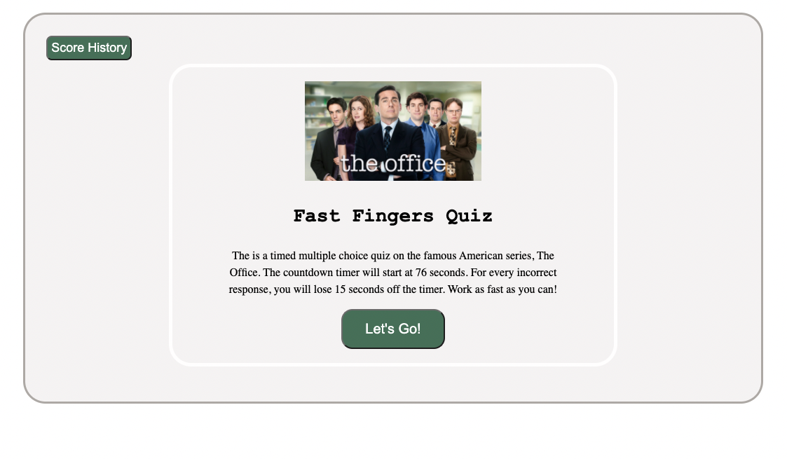

# Multiple choice quiz app
## It is required to design a multiple choice quiz in javascript, time is very important as every wrong answer will deduct 15 second and the final score is the time left.
## The work included:
### <li> Establishing all the elements in the index.html file.
### <li> Define them in the javascript file and start the action.
### <li> I set the starting time to 76 second as one second will be gone after hitting start.
### <li> As the time is running every wrong answer fromt he the five questions will deduct 15 second from the time, so that make sure that speed does not give a score when all answers are wrong.
### <li> After hitting start I used render function to show the next question if the question index is less than question length.
### <li> When quis finished it will show the score and ask for to input the initial so store it.
### <li> After storing the score I can start a new quiz or I can show the history of the scors and delete it.
## I use in this work:
### <li> HTML 
### <li> CSS
### <li> Javascript
  
## Bellow is a screenshot for the app

  
### Link of the deployed work
  
https://omarasamarai.github.io/04-challenge/
  
### Omar Asamarai

  
